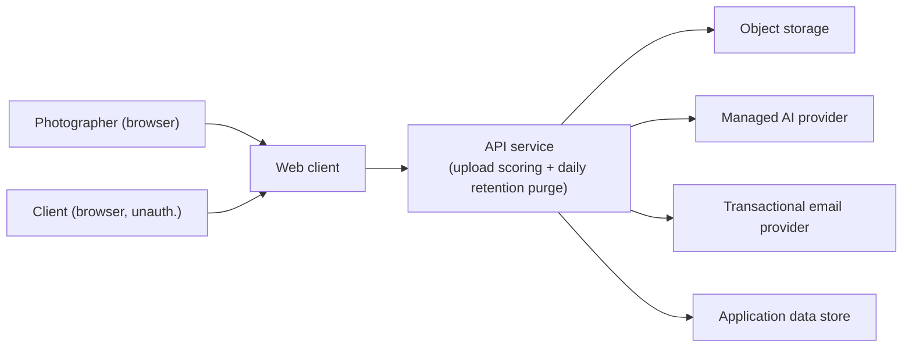

# Architecture — Photographer SaaS

System architecture for the photographer SaaS MVP: components, data, boundaries, stack. Architecture decisions live here; they are the contract between the spec and any future implementation. Diagrams are embedded as Mermaid.

Workflow phase: **Phase 6 — Technical Architecture.** Driving skill: `technical-planner` (using `starter-stack-advisor` to propose a default-stack baseline; the choices below are recorded as decisions, not template defaults).

Related artifacts: [`product-thesis.md`](product-thesis.md), [`mvp-scope.md`](mvp-scope.md), [`user-journeys.md`](user-journeys.md), [`intelligence-layer.md`](intelligence-layer.md), [`spec.md`](spec.md), [`deployment.md`](deployment.md), [`decisions.md`](decisions.md).

---

## 1. Architecture overview

The system is a **single-page web client + a thin API service + object storage for image bytes + a managed AI provider for per-frame scoring**. The most important boundary is between the photographer-facing surface (authenticated, full feature set) and the client-facing surface (unauthenticated, scoped to one delivery link). Everything else flows from that split. The architecture has no public API surface, no general-purpose background-worker farm, and no mobile client. The API deployment owns two narrow asynchronous behaviors: the upload-time scoring pass and one provider-neutral daily trigger for the idempotent retention purge. Total: four components.

## 2. System diagram

The diagram captures every component the MVP touches. Anything not on this diagram is out of scope for v1.

## 3. Components

### Web client (single-page app)

- **Responsibility:** Render the four screens in [`design.md`](design.md) §3 (dashboard, upload + AI-review, client delivery link, finalized selections). Drive the photographer interaction loop. Render the unauthenticated client-side delivery view.
- **Boundary:** Does **not** call the AI provider directly — every AI call routes through the API. Does not access object storage directly except via signed upload/download URLs minted by the API.
- **Owns the data:** No data; the client is a view layer.

### API service

- **Responsibility:** Authenticate photographers; mint and validate delivery-link tokens; accept image uploads (via signed URLs to object storage); enqueue and dispatch the per-gallery AI-suggestion pass; persist gallery / image / suggestion / selection state; send the photographer's "client finalized" email; and run the idempotent daily purge for expired application records.
- **Boundary:** Does **not** render UI. Does not include a general-purpose worker farm or queue. The only recurring work is the narrow provider-neutral daily retention trigger; the only other asynchronous work is the upload-time scoring pass. Does not expose a public, third-party-callable API surface in v1.
- **Owns the data:** Photographer accounts, galleries, image references (paths in object storage), AI suggestion results, client selections, delivery-link tokens.

### Object storage

- **Responsibility:** Hold the original JPEG bytes uploaded by the photographer and the derived thumbnails the client view renders.
- **Boundary:** Does **not** receive or store any AI scoring data. Does not serve URLs without a signed token from the API.
- **Owns the data:** Image bytes only.

### Managed AI provider

- **Responsibility:** Score uploaded frames per [`intelligence-layer.md`](intelligence-layer.md) §2. Returns scores and labels.
- **Boundary:** After a specific provider is accepted, receives only downscaled image bytes and opaque per-frame IDs; receives no identifying metadata. A dated written no-retention/no-training commitment is a pre-integration condition. The provider cannot make outbound calls back into this system.
- **Owns the data:** None. All scoring outputs live in the application data store.

(A transactional email provider and a small application data store are also touched — both are stock infrastructure; they are listed in §5 rather than promoted to first-class components, to keep the v1 component count at four.)

## 4. Data model

The minimum viable data model. This is a conceptual model, not a database schema.

- **Photographer** — fields: id, email, password-hash, created-at; owned by API service; lifecycle: created at signup, retained until photographer-deletion request.
- **Gallery** — fields: id, photographer-id, title, status (`uploading | suggesting | review | sent | open | finalized | stalled`), created-at, finalized-at; owned by API service; lifecycle: created on upload-start, finalized when client acts, deleted 90 days after finalization unless extended ([`intelligence-layer.md`](intelligence-layer.md) §4).
- **Image** — fields: id, gallery-id, storage-path, content-hash, dimensions, exif (sanitized: GPS stripped); owned by API service (storage path), bytes owned by Object storage; lifecycle: tied to parent gallery's lifetime.
- **Suggestion** — fields: image-id, score, suggested-bool, label-set (subset of `sharp | eyes-open | composition | duplicate-of-<image-id>`), provider, model-version, scored-at; owned by API service; lifecycle: tied to parent gallery; never sent to client surface.
- **DeliveryLink** — fields: id, gallery-id, token (high-entropy random), created-at, expires-at; owned by API service; lifecycle: created when photographer sends the link, valid until gallery deletion or explicit revoke.
- **Selection** — fields: image-id, delivery-link-id, marked-at, finalized-bool; owned by API service; lifecycle: tied to delivery link.
- **PhotographerOverride** — fields: image-id, photographer-id, kept-bool, overridden-at; owned by API service. Captures what the photographer kept vs. rejected during Screen 2 review without rewriting the model's closed-vocabulary reason labels.
- **DeletionTombstone** — fields: opaque deleted-record ID, deletion-effective-at, snapshot-expiry-at; owned by the application but stored in an isolated retention-control namespace outside the application database's snapshot lineage. Retained until every snapshot capable of containing the deleted record has expired, then removed.

A note on identity for the client surface: the client never has an account. Selections are scoped to the delivery-link token; the system never asks the client to identify themselves.

## 5. External dependencies

- **S3-compatible object storage:** stores image bytes → fallback: any S3-compatible provider (the integration uses signed URLs, which most providers support); a dependency on a specific vendor would be flagged in [`decisions.md`](decisions.md).
- **Managed AI provider (vision-language scoring, unresolved):** after a later accepted entry names a provider and records its dated written commitment, it provides the per-frame scoring from [`intelligence-layer.md`](intelligence-layer.md) §2 → fallback: the manual path or a second provider that independently satisfies the same boundary and eval gate; on outage, the gallery falls through to "no pre-marks; photographer marks by hand" and the loop still completes.
- **Transactional email provider:** sends the "client finalized" email to the photographer → fallback: any SMTP provider; not load-bearing for the thesis.
- **Application data store (relational, single instance):** holds the Photographer / Gallery / Image / Suggestion / etc. records → fallback: standard backup/restore from snapshots ([`deployment.md`](deployment.md) §7); single-region MVP, no managed multi-region replication.

The architecture does **not** depend on: a dedicated message queue, a search index, a CDN beyond what object storage provides, a vector store, a feature flag service, or analytics infrastructure.

## 6. Key architectural decisions

- **Decision: Single-page web client; no native mobile app for v1.** *Because* both audiences use desktop or tablet primarily; mobile-web is sufficient ([`non-goals.md`](non-goals.md) §1). (See [`decisions.md`](decisions.md) DEC-2.)
- **Decision: Synchronous-from-the-photographer's-perspective AI scoring at upload time, no general-purpose worker farm.** *Because* introducing a worker platform widens the failure surface for no thesis-critical gain. One narrow scheduled retention purge is permitted inside the API deployment because it enforces the accepted deletion promise. (See [`decisions.md`](decisions.md) DEC-3 and DEC-11.)
- **Decision: Client surface is unauthenticated, token-scoped only.** *Because* asking clients to create accounts adds friction on the slow side of the loop ([`problem-statement.md`](problem-statement.md) §2) and produces no value for the wedge. (See [`decisions.md`](decisions.md) DEC-3.)
- **Decision: One managed AI provider for v1, with the specific provider unresolved and a second provider designed-in but not enabled.** *Because* one accepted provider keeps the cost and security review small while leaving a switch path. Integration stays blocked until a later entry names it and records the dated written commitment. (See [`decisions.md`](decisions.md) DEC-4 and DEC-11.)
- **Decision: 90-day retention for client photos, enforced across storage, application data, and restores.** *Because* the privacy commitment in [`intelligence-layer.md`](intelligence-layer.md) §4 is load-bearing for trust; retention has to be enforced, not just promised. Storage lifecycle and the daily database purge operate before real photos are admitted. Opaque tombstones outside the snapshot lineage are applied with current-time expiry before a restore can receive traffic. (See [`decisions.md`](decisions.md) DEC-5 and DEC-12.)

Every decision named here has a corresponding entry in [`decisions.md`](decisions.md).

## 7. Non-functional constraints

- **Latency target:** photographer Screen 1 (dashboard) loads under 1 s on a typical broadband connection; AI scoring of a 600-frame gallery completes within 5 minutes wall time at typical provider latencies. A future implementation validates both targets with synthetic fixtures before launch.
- **Throughput target:** support five concurrent active photographers each uploading a 600-frame gallery without queue starvation. A future implementation validates the target in staging before launch.
- **Availability target:** 99% monthly for the photographer-facing surface; no specific target for the client-facing surface in v1 (it is read-mostly and tolerant of a brief outage during a client's selection week). A future implementation measures this on the API after deployment.
- **Initial operating-cost target:** total monthly infra + AI cost stays under **$200/month at ≤10 active photographers** and their expected volume. This is a planning target, distinct from the larger technical capacity envelope, and a future implementation validates it with monthly cost rollups ([`deployment.md`](deployment.md) §8).
- **Legal/privacy review:** the planned deletion, provider, and notice controls are illustrative design measures. A real launch requires qualified, jurisdiction-specific review to determine applicable regimes, notices, terms, consent, deletion, subprocessor, and related treatment; the design itself establishes no compliance conclusion.

## 8. Boundaries with the intelligence layer

The intelligence layer is reached only via the API service's model-call boundary. That boundary forwards downscaled image bytes and opaque per-frame IDs and nothing else; it strips identifying metadata before the call (allow-list, not deny-list, per [`intelligence-layer.md`](intelligence-layer.md) §7). Internal photographer and cost attribution use application-side mapping from the opaque frame ID and never widen the provider input. The AI's output vocabulary is closed, schema-validated at the boundary, and stored in the application data store. A future implementation must test single-gallery request construction and reject cross-gallery context; these are mitigations, not proof that the boundary cannot fail. Image-mediated prompt injection remains possible and non-conforming output falls through to manual review. If a future capability needs cross-gallery context, the boundary, privacy treatment, and accepted decision must change first.

---

## Optional sections

### A. Alternatives considered

- **A serverless function-only architecture (no long-running API service).** Rejected because the upload-time scoring pass is naturally a long-ish, gallery-scoped operation, and serverless cold starts plus per-call costs would erode the cost ceiling. The thin always-on API service is a smaller surface for v1.
- **A self-hosted open-source vision model on a GPU instance.** Rejected for v1 because the operating overhead (GPU instance lifecycle, model serving) exceeds the synthetic founder's solo time budget. The unresolved managed-provider path remains subject to later cost validation. Self-hosting is deferred work, not an alternate first-iteration trigger; DEC-8's sustained override-rate signal remains the sole accepted first trigger.
- **A single-component monolith with image bytes in the database.** Rejected because storing image bytes in the relational database is a known anti-pattern at the volumes this product touches (200–2,500 images × 5–40 galleries/month) and would compromise backup and retention enforcement.

### B. Open architectural questions

- **Per-photographer cost attribution at scale.** When the active-photographer pool grows past ten, individual cost rollups become important. Keep attribution internal by mapping the opaque frame ID back to photographer and gallery records after each call; never transmit a photographer ID to the provider.
- **Whether the client-facing surface should be served from the same API or a small read-only edge cache.** Cheapest experiment: measure client-surface read latency in production against the simple shared-API path; only split if the latency target in §7 cannot be met.

### C. Operational concerns

- **Backups and restores.** The relational store is snapshotted daily ([`deployment.md`](deployment.md) §7). Opaque deletion tombstones are outside that snapshot lineage and remain until all capable snapshots expire. Every restore applies tombstones and current-time expiry before promotion; failure blocks traffic. Object-storage lifecycle plus the API-owned datastore purge enforce the 90-day rule.
- **Observability.** Per-API-route latency and error rate; per-gallery scoring latency and fallback rate; total monthly cost. Specifics in [`deployment.md`](deployment.md) §5.
- **On-call.** Solo founder, dashboard-watched daily. Specifics in [`deployment.md`](deployment.md) §6.

### D. Scaling envelope

The only planned technical capacity envelope is **≤ 50 active photographers and ≤ 50,000 images per month**; it is distinct from the §7 operating-cost target at ≤10 active photographers and remains subject to future load validation. Anything beyond 50/50,000 is unvalidated and requires fresh performance, cost, and architecture requalification before it can be claimed. The deferred per-photographer style-tuning idea would expand the data model and is not part of this envelope or an alternate first-iteration trigger.
