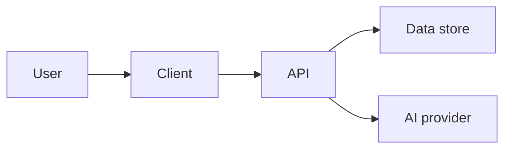

# Architecture — Project template

> **Purpose.** Describe the **system architecture** of the project: components, data, boundaries, and the stack. Architecture decisions live here; they are the contract between the spec and the implementation. Diagrams are embedded as Mermaid (or other text-based notation) inside this file when possible — the artifact must be readable on any agent, with no proprietary file formats.
>
> **Workflow phase.** Phase 6 — Technical Architecture.
>
> **Driving skill.** `technical-planner` (optionally invoking `starter-stack-advisor` for default-stack guidance).
>
> **How to use this template.**
> - Replace `<…>` placeholders.
> - Keep blockquoted guidance (`>` lines) while drafting; remove or replace before considering the artifact filled.
> - Stable headings — downstream skills rely on them.
> - **Agent-neutral.** Do not assume a specific cloud, framework, or language unless the project has explicitly chosen one in [`decisions.md`](decisions.md). State choices as decisions with reasons.
> - **Profile applicability.** This artifact is **Required** for New Product Build, **Conditional** for Existing Project Change, and **Need-triggered** for Lightweight/Internal Build when system shape, stack, data, dependencies, or technical boundaries are new or changed.
> - **Section depth.** Numbered sections are required when this artifact is Required, Profile-triggered, or Need-triggered for the selected profile; optional sections stay optional unless project facts make them need-triggered.
> - **Semantic readiness.** This artifact is ready only when it explains the system shape, components, data model, dependencies, decisions, constraints, and boundaries with the intelligence layer at the depth selected by the profile. Placeholder cleanup alone is not enough.
> - **Reference example fill:** `project-system/examples/photographer-saas/architecture.md`.

Related artifacts: [`product-thesis.md`](product-thesis.md), [`mvp-scope.md`](mvp-scope.md), [`user-journeys.md`](user-journeys.md), [`intelligence-layer.md`](intelligence-layer.md), [`spec.md`](spec.md), [`deployment.md`](deployment.md), [`decisions.md`](decisions.md).

---

## 1. Architecture overview

> One short paragraph. The shape of the system in plain language: what kind of application this is (e.g., single-page web app + thin API + managed AI provider), and the most important boundary in the system. A reader should be able to recognize the architecture from this paragraph alone.

<…>

## 2. System diagram

> A text-based diagram (Mermaid `flowchart`, ASCII, or similar) showing the main components and their connections. Keep it small — if it does not fit on one screen, the architecture is probably more complex than the MVP needs.

> Replace the placeholder diagram with one that matches the actual system. Use clear, lowercase node names; do not embed implementation details into the diagram.

## 3. Components

> The major components in the system. For each component: name, responsibility (one line), the boundaries it is *not* allowed to cross. Keep this list short — for a v0.1 MVP, 3–6 components is typical.

### <component>

- **Responsibility:** <…>.
- **Boundary:** <what this component does not do>.
- **Owns the data:** <which data this component is the source of truth for, if any>.

### <component>

- **Responsibility:** <…>.
- **Boundary:** <…>.
- **Owns the data:** <…>.

## 4. Data model

> The minimum viable data model. List the key entities, the relationships between them, and which component owns each entity. This is **not** a full database schema; it is the conceptual model the implementation is built against.

- **<entity>** — fields: <…>; owned by: <…>; lifecycle: <…>.
- **<entity>** — fields: <…>; owned by: <…>; lifecycle: <…>.
- **<entity>** — fields: <…>; owned by: <…>; lifecycle: <…>.

## 5. External dependencies

> Services, APIs, models, or platforms the project depends on. For each: name, role, fallback if it disappears or fails. If the project depends on a managed AI provider, name it and the fallback strategy here; full intelligence-layer detail belongs in [`intelligence-layer.md`](intelligence-layer.md).

- **<dependency>:** role → fallback.
- **<dependency>:** role → fallback.
- **<dependency>:** role → fallback.

## 6. Key architectural decisions

> Up to 5 architectural choices that the project has *committed* to and that downstream tasks depend on. Each decision: a one-line statement and a one-line reason. **Every decision named here must also have a corresponding entry in [`decisions.md`](decisions.md).**

- **Decision:** <…> — *because* <…>. (See [`decisions.md`](decisions.md).)
- **Decision:** <…> — *because* <…>. (See [`decisions.md`](decisions.md).)

## 7. Non-functional constraints

> Latency, throughput, availability, durability, cost, and any compliance constraint. State the target and how it will be validated. If a constraint has no specific target, write "no specific target" rather than inventing one.

- **Latency:** <target> — validated by <…>.
- **Throughput:** <target> — validated by <…>.
- **Availability:** <target> — validated by <…>.
- **Cost ceiling:** <target> — validated by <…>.
- **Compliance:** <none | specific regime> — validated by <…>.

## 8. Boundaries with the intelligence layer

> One short paragraph. Where the AI layer fits in the architecture, what it can and cannot reach, and how its outputs are consumed by the rest of the system. Full design lives in [`intelligence-layer.md`](intelligence-layer.md); this section names the boundary so the architecture stays honest.

<…>

---

## Optional sections

### A. Alternatives considered *(optional)*

> Architectures or stacks that were considered and rejected. For each: name, why it was rejected. Keeps future contributors from re-litigating settled questions.

### B. Open architectural questions *(optional)*

> Unresolved questions that will block later tasks. Each entry: question and the cheapest experiment to resolve it. Resolved questions move to [`decisions.md`](decisions.md).

### C. Operational concerns *(optional)*

> Backups, observability, on-call patterns, and disaster recovery if the project takes on these concerns at MVP scope. Skip if not in scope; cross-references [`deployment.md`](deployment.md).

### D. Scaling envelope *(optional)*

> The expected user / data / request volume for the MVP and the next plausible step beyond it. Helps prevent over-engineering.
